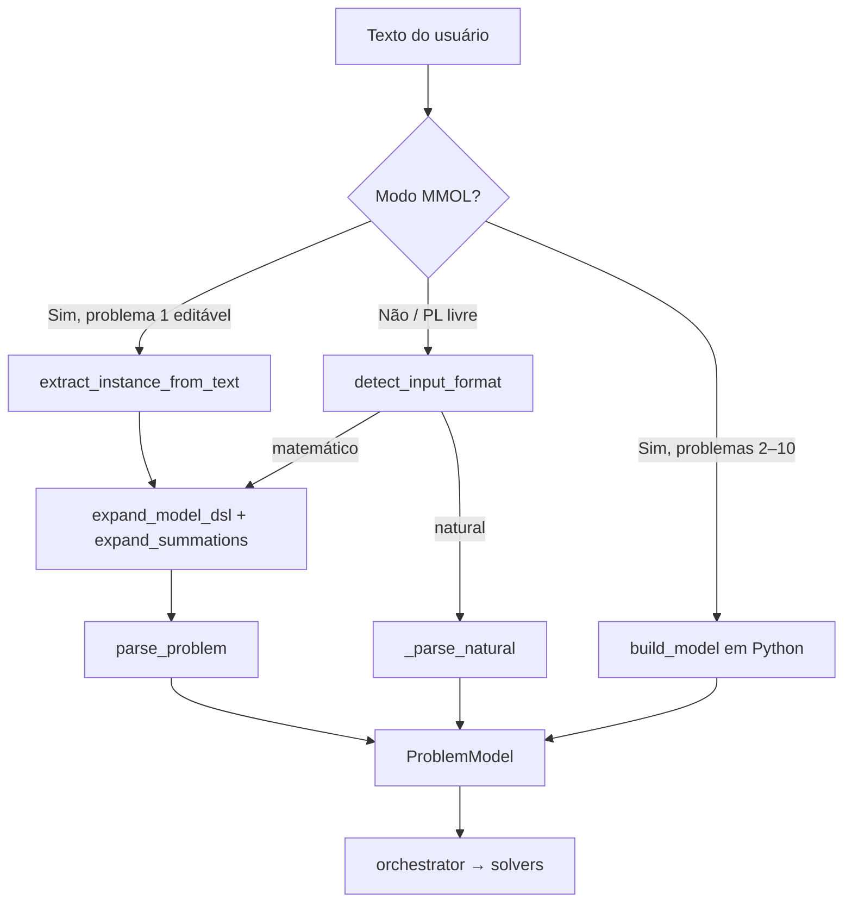

# PO Educacional v1.0

Sistema web educacional de **Pesquisa Operacional** (PPGCC — UFERSA/UERN), desenvolvido para a disciplina **Modelos e Métodos de Otimização Linear (MMOL)**.

Inclui **Simplex pedagógico**, **Branch and Bound** interativo, **Branch and Cut (Gomory)**, **dualidade**, **método gráfico**, **algoritmo genético** e os **10 problemas clássicos da lista MMOL** com modelagem compacta comentada (`∀`, `Σ`, `@dados`, `@modelo`).

Repositório: [Guilherme-ASF/po-educacional](https://github.com/Guilherme-ASF/po-educacional)

---

## Funcionalidades (v1.0)

| Área | Recursos |
|------|----------|
| **Entrada** | PL/PLI em texto, linguagem natural, DSL compacto MMOL |
| **Métodos** | Simplex, gráfico (2 vars), relaxação LP, B&B, B&C, Gomory, dualidade, GA |
| **B&B / B&C** | Árvore com pan/zoom; tableau por nó; cortes de Gomory comentados |
| **MMOL** | 10 problemas com instância padrão, modelagem pedagógica e Z* validados |
| **API** | FastAPI REST — `/api/solve`, `/api/mmol/*` |

---

## Requisitos

- **Python** 3.11+
- **Node.js** 18+ e npm

---

## Instalação e execução

### 1. Backend (porta 8001)

```powershell
cd backend
python -m venv venv
.\venv\Scripts\activate
pip install -r requirements.txt
uvicorn app.main:app --reload --port 8001
```

### 2. Frontend (porta 5173)

```powershell
cd frontend
npm install
npm run dev
```

Abra **http://localhost:5173** (o Vite faz proxy para a API em `8001`).

---

## Bibliotecas utilizadas

### Backend (Python)

| Biblioteca | Versão | Papel no projeto |
|------------|--------|------------------|
| [FastAPI](https://fastapi.tiangolo.com/) | 0.115.6 | API REST (`/api/solve`, `/api/mmol/*`) |
| [Uvicorn](https://www.uvicorn.org/) | 0.34.0 | Servidor ASGI do backend |
| [NumPy](https://numpy.org/) | 2.2.1 | Álgebra linear (tableau, vértices, manipulação numérica) |
| [SciPy](https://scipy.org/) (`optimize.linprog`) | 1.17.1 | Relaxação LP nos subproblemas B&B/B&C (HiGHS) |
| [python-multipart](https://github.com/Kludex/python-multipart) | 0.0.20 | Suporte a formulários multipart no FastAPI |

**Biblioteca padrão Python** (sem instalação extra): `re`, `dataclasses`, `copy`, `functools`, `math`, `time`, `typing`.

**Implementação própria (sem dependência externa de PLI):** Simplex pedagógico, Branch and Bound, Branch and Cut (Gomory), método gráfico, algoritmo genético, parsers e builders MMOL.

### Frontend (JavaScript / TypeScript)

| Biblioteca | Versão | Papel no projeto |
|------------|--------|------------------|
| [React](https://react.dev/) | 18.3.1 | Interface (editor, relatório, árvore B&B) |
| [React DOM](https://react.dev/) | 18.3.1 | Renderização no navegador |
| [Vite](https://vite.dev/) | 6.0.5 | Dev server, build e proxy para API |
| [@vitejs/plugin-react](https://github.com/vitejs/vite-plugin-react) | 4.3.4 | Suporte JSX/TSX no Vite |
| [TypeScript](https://www.typescriptlang.org/) | 5.6.2 | Tipagem estática do frontend |
| [KaTeX](https://katex.org/) | 0.16.11 | Renderização de fórmulas LaTeX na UI |

**Dev:** `@types/react`, `@types/react-dom`, `@types/katex` — definições de tipos TypeScript.

### O que não usamos

CPLEX, Gurobi, OR-Tools, GLPK, PuLP, Pyomo ou qualquer solver MIP comercial/integrado como caixa-preta para PLI.

---

## Parser e modelagem dos problemas

O sistema converte texto em um `ProblemModel` interno (objetivo, restrições, tipos de variável) por **três caminhos**, conforme a origem da entrada:



### 1. Modo livre — `input_parser.py`

1. **`detect_input_format`** — classifica a entrada:
   - **natural** — frases (“maximizar lucro…”, “produto A…”); ignora linhas `#` comentário.
   - **simplificado** — coeficientes colados (`8x1`, `x1*5`).
   - **matemático** — `Max/Min Z = …`, restrições explícitas.
   - Textos com `@dados` / `@modelo` (MMOL) nunca são tratados como linguagem natural.

2. **`parse_problem`** — pipeline principal:
   ```
   texto → expand_model_dsl → expand_summations → _parse_structured
   ```
   ou `_parse_natural` quando aplicável.

3. **`_parse_structured`** — lê linha a linha (regex):
   - objetivo (`Max`/`Min`/`Z =`);
   - restrições (`<=`, `>=`, `=`);
   - domínio (`binário`, `inteiro`, `>= 0`);
   - ignora comentários `#` e linhas `∀` (já expandidas antes).

### 2. DSL compacto — `model_dsl.py` + `summation_expander.py`

Usado principalmente no **problema 1 (multiprocessador)** quando o usuário edita `@dados`:

| Bloco | Conteúdo |
|-------|----------|
| `@dados` | tarefas, servidores, capacidade `C`, tempos `p(t,s)` |
| `@modelo` | formulação com `∀` e `Σ` (referência pedagógica) |
| `@dominio` | tipos das variáveis |

- **`expand_model_dsl`** — lê `@dados` e gera PL expandido com variáveis `x_{t,s}`, makespan `M` e comentários com os tempos.
- **`expand_summations`** — expande notação indexada, por exemplo:
  - `∀ t: Σ_s x_{t,s} = 1` → uma equação por tarefa;
  - `∀ s: Σ_t p[t,s]·x_{t,s} ≤ C` → uma restrição por servidor.

### 3. Lista MMOL — `problems/` + `mmol_text.py`

Para os **10 problemas da disciplina**, a modelagem na interface vem de **`mmol_to_text`**: texto compacto com `@dados`, `@modelo`, `@dominio`, comentários e símbolos `∀`/`Σ`.

Na resolução, o backend **não re-parseia** esse texto (exceto P1 com B&B editável). Usa **`build_model(chave, instancia)`** — builders Python em `problems/*.py` que montam o `ProblemModel` diretamente:

| Módulo | Problema |
|--------|----------|
| `multiprocessor.py` | 1 — alocação multiprocessador |
| `project_selection.py` | 2 — seleção de projetos |
| `knapsack_md.py` | 3 — knapsack multidimensional |
| `bin_packing.py` | 4 — bin packing |
| `production_setup.py` | 5 — setup de produção |
| `set_covering.py` | 6 — set covering |
| `tsp.py` | 7 — TSP (MTZ) |
| `facility_location.py` | 8 — facility location |
| `cutting_stock.py` | 9 — cutting stock (padrões gerados) |
| `timetabling.py` | 10 — grade de horários |

`registry.py` centraliza instâncias padrão, normalização JSON (`instance_to_json`) e roteamento.

### 4. Saída pedagógica — `pedagogical/formatter.py`

- **`model_to_text`** — PL expandido (fallback ou problemas sem DSL compacto).
- **`model_to_latex`** — mesma modelagem em LaTeX para o frontend (KaTeX).

### Fluxo resumido (MMOL)

```
GET /api/mmol/model  →  mmol_to_text  →  editor (texto comentado)
POST /api/mmol/solve →  build_model   →  orchestrator  →  B&B / B&C / solver dedicado
```

---

## Uso rápido

### Modo livre (PL / PLI)

1. Cole o problema no editor (ou use linguagem natural).
2. Escolha o método (ex.: **Branch and Bound** para inteiros).
3. Clique em **Resolver**.
4. Na árvore B&B, **clique em um nó** para ver o tableau da relaxação.

### Modo MMOL (10 problemas)

1. Marque **Problema da lista (10 modelos)** na barra lateral.
2. Selecione o problema (1–10).
3. A modelagem compacta comentada carrega automaticamente.
4. Escolha o método sugerido ou outro compatível e resolva.

O **Guia de modelagem** acima do editor explica símbolos: `∀`, `Σ`, `x[t,s]`, `p(t,s)`, `@dados`, etc.

---

## Política de solvers (regras MMOL)

Conforme o enunciado do trabalho:

| Permitido | Uso no projeto |
|-----------|----------------|
| **numpy** | Álgebra linear (ex.: vértices, manipulação de tableau) |
| **scipy.optimize.linprog** | Apenas **relaxações LP** (subproblemas contínuos no B&B/B&C) |
| **Simplex pedagógico próprio** | Tableau passo a passo, dualidade |
| **B&B / B&C próprios** | Solução principal de PLI/PLIB |
| **Algoritmos dedicados** | Enumeração / DP nos problemas 1, 4, 7, 9, 10 |

| **Não permitido** | Status |
|-------------------|--------|
| CPLEX, Gurobi, OR-Tools, GLPK como caixa-preta para PLI | Não utilizado |
| Solver MIP comercial integrado | Não utilizado |

O **Z*** de problemas inteiros vem do **B&B**, **B&C** ou **solver dedicado** documentado — nunca de solver de PLI externo.

---

## Lista MMOL — instâncias e Z* esperados

| # | Chave | Método sugerido | Z* (instância padrão) |
|---|--------|-----------------|------------------------|
| 1 | `1_multiprocessador` | Branch and Bound | 7 |
| 2 | `2_selecao_projetos` | Branch and Bound | 420 |
| 3 | `3_knapsack_multidimensional` | Branch and Bound | 165 |
| 4 | `4_bin_packing` | Branch and Bound | 3 |
| 5 | `5_setup_producao` | Branch and Bound | 490 |
| 6 | `6_set_covering` | Branch and Bound | 230 |
| 7 | `7_tsp` | Branch and Cut | 70 |
| 8 | `8_facility_location` | Branch and Bound | 53 |
| 9 | `9_cutting_stock` | Branch and Bound | 9 |
| 10 | `10_timetabling` | Branch and Cut | 36 |

Validação automatizada:

```powershell
cd backend
.\venv\Scripts\activate
python ..\tests\run_mmol.py
python ..\tests\run_casos.py
```

---

## API REST

### Resolver problema livre

```http
POST http://localhost:8001/api/solve
Content-Type: application/json

{
  "input_text": "Max Z = 8x1 + 5x2\n...",
  "method": "Branch and Bound"
}
```

### MMOL

```http
GET  http://localhost:8001/api/mmol/problems
POST http://localhost:8001/api/mmol/model
POST http://localhost:8001/api/mmol/solve

{ "problema": "4_bin_packing", "method": "Branch and Bound" }
```

Resposta pedagógica estruturada: `1_identificacao` … `8_conclusao`. B&B inclui `4_resolucao.branch_and_bound.nos` (árvore) e `desempenho`.

---

## Estrutura do projeto

```
backend/app/
  parsers/           # Entrada textual, DSL, expansão Σ
  problems/          # 10 builders MMOL + mmol_text (modelagem compacta)
  solvers/           # Simplex, B&B, B&C, gráfico, GA, scipy LP
  orchestrator.py    # Fluxo pedagógico unificado
frontend/src/
  components/        # BranchBoundTree, ModelingGuide, SolutionReport, …
tests/               # run_mmol.py, run_casos.py, casos/
report/relatorio.md  # Modelo do relatório técnico (PDF)
docs/                # Compatibilidade MMOL
```

---

## Relatório técnico

Modelo em `report/relatorio.md` (máx. 8 páginas em PDF). Exporte com Pandoc, Word ou imprima do editor Markdown.

---

## Versão e histórico

- **v1.0.0** — Release completo: 10 problemas MMOL, modelagem compacta, B&B/B&C interativo, dualidade, GA, testes.
- Tags anteriores `v0.1.0` … `v0.8.0` documentam a evolução incremental no GitHub.

---

## Licença e autoria

PPGCC — UFERSA. Autor: Guilherme ASF.
